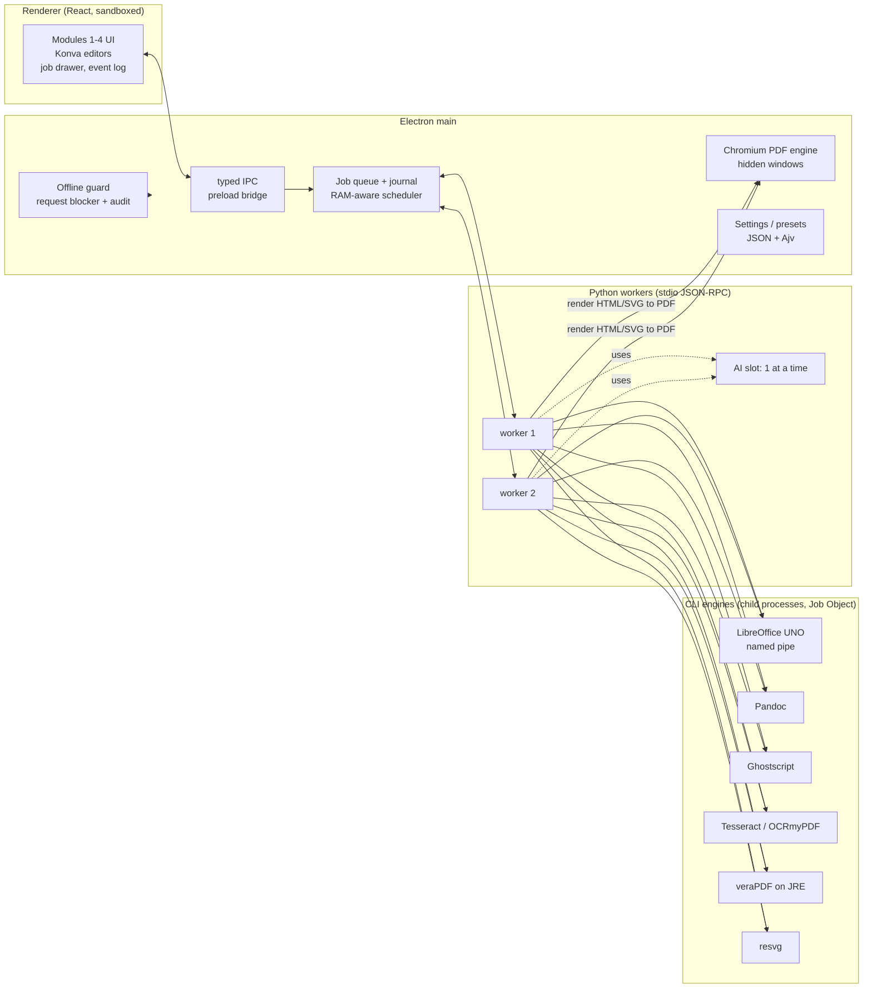

# Offline Toolkit — Phase 0: architecture

Status: decisions confirmed on 2026-09-30 (§0). **Phases 1–3 (Modules 1–3) are implemented** (Module 2 as built: §7.7; Module 3 as built: §8.1); test results are in [TEST_REPORT.md](TEST_REPORT.md). The Module 2 route planner is written and tested, because the conversion matrix is generated from it (see [CONVERSION_MATRIX.md](CONVERSION_MATRIX.md)).

**Phase 1 implementation notes (differences from the plan below, all intentional):**

- **Workers.** Two workers run instead of a RAM-sized pool: one for interactive previews and one for batches, so a long batch never blocks the preview. The RAM-aware scheduler and the job journal (resume) come with Module 2, where jobs are long.
- **CSP-blocked requests are recorded.** The page's Content-Security-Policy stops fetches before Chromium's request hook sees them, so those violations are forwarded to the offline audit too.
- **Sandbox exception for tests.** Electron's sandbox is forced on for every process unless `--no-sandbox` is passed explicitly. Chromium requires that switch when running as root, which only happens in CI containers.
- **Offline proof on Linux.** `scripts/test-offline.sh` brings up only the loopback interface inside the network namespace, because Playwright drives Electron over a local debugging connection. No other interface exists.

Companion documents:

- [ENGINES.md](ENGINES.md): every bundled component with its license, size and GPL/AGPL flags.
- [CONVERSION_MATRIX.md](CONVERSION_MATRIX.md): all 208 source→target pairs (304 routes across both modes), generated by the planner.

---

## 0. Decisions (confirmed 2026-09-30)

| # | Decision | What it changes |
|---|---|---|
| D1 | **Personal use only.** The app will not be redistributed. | PyMuPDF and Ghostscript (both AGPL-3.0) stay: copyleft obligations only apply when you distribute. No project license is added; the README says "personal use, not for redistribution". Third-party license texts still ship inside the app, which is harmless. If you ever want to share the app, revisit [ENGINES.md §3](ENGINES.md#3-copyleft--only-matters-if-you-ever-redistribute). |
| D2 | **Lite bundle only.** No LaMa, no IS-Net, no Chinese/Japanese/Korean (CJK) fonts, fewer OCR languages. | About **1.5–1.9 GB installed, 0.6–0.8 GB download** (ENGINES.md). Module 3 text removal uses classical OpenCV inpainting (§8 step 4). Module 3 cut-outs use MODNet for people and OpenCV GrabCut for other objects (§8 step 5). CJK text relies on the fonts Windows already ships (§11). Tesseract uses the compact `tessdata_fast` models, with no Japanese or Korean OCR. There is a single build, so no full/lite switch is needed. |
| D3 | **No separate "4.5×3.5 cm" passport preset.** | It is the same size as 35×45 mm, so there is one preset labelled "35×45 mm (3.5×4.5 cm)". |
| D4 | **Separate repository.** | The toolkit moves to its own repository, with this folder as its root and its history kept. The move is pending: GitHub would not let me create the repository from this session, so you need to create it first. |
| D5 | **Windows builds come from CI** (information, not a choice). This session runs in a Linux container, and several download hosts (LibreOffice, Pandoc, veraPDF sites, GitHub release assets, Hugging Face) are blocked here. | I build and test on Linux with the same engines (from apt/PyPI/Maven here). Windows installers and Windows tests run through a GitHub Actions workflow (`windows-latest`) that I'll write. Each phase reports which tests actually ran where. |

Python stays on **3.11** as you asked. Every dependency has 3.11 wheels today. numpy is pinned to 2.4.x because numpy 2.5 requires 3.12. Moving to 3.12 later is a one-line change.

---

## 1. Summary

```
Electron (main)  ──stdio JSON-RPC──►  Python worker pool (1–3 processes)
   │  owns: windows, IPC, job queue,        │  owns: all image/document/AI work
   │  settings, logs, offline guard,        │  spawns CLI engines inside a Windows
   │  Chromium PDF engine                   │  Job Object: LibreOffice, Pandoc,
   ▼                                        │  Ghostscript, Tesseract, veraPDF (JRE), resvg
React renderer (sandboxed, no Node, CSP: connect-src 'none')
```

- **Nothing listens on a network port.** Workers speak JSON-RPC over stdin/stdout. LibreOffice UNO uses a named pipe. The UI is served from a custom `otk://` protocol, not a localhost server.
- **Heavy work never runs in the UI or the Electron main process.** The renderer only shows proxies (previews at most 2048 px, or tiles). Edits are stored as parameters and applied at full resolution in a worker when you export.
- **Data-driven**: presets, passport specs, paper sizes, OCR languages, fonts and the whole Module 2 route graph are JSON files you can edit. They are validated against JSON Schemas, and a bad file falls back to the shipped copy with a readable error.

---

## 2. Stack, and where I deviate from your preferred stack

| Area | Choice | Why / deviation |
|---|---|---|
| Shell | **Electron** (latest stable, 44.x at time of writing) + React 19 + TypeScript + Vite (electron-vite) | Electron over Tauri. `printToPDF` gives Chromium-quality HTML/TXT/SVG→PDF with HarfBuzz shaping for Indic and RTL scripts. The renderer is identical on every OS, whereas Tauri uses WebKitGTK on Linux. No dependency on the Windows WebView2 runtime. |
| Canvas | **Konva** (react-konva) | Used for the Module 3 editor, Module 4 overlays and the cropper. One scene-graph library everywhere. |
| Cropper | **Custom Konva cropper** (your spec allows this) | Needs straightening with automatic zoom so no blank corners appear, exact source-pixel maths shared by Modules 1 and 4, and a parametric output (rect + angle + flip) that the worker applies at full resolution. Cropper.js v2 is web-component based and has no built-in straightening. |
| State / undo | zustand + immer patches | Undo/redo is a stack of immer patches, so it's cheap even for big scenes. |
| Worker runtime | **CPython 3.11** from python-build-standalone, with wheels installed into it at build time | Instead of PyInstaller: no bootloader triggering antivirus false positives on Windows, quicker start, and dependencies can be patched without a rebuild. |
| OCR | **RapidOCR** (PaddleOCR PP-OCR models running on ONNX Runtime) + **Tesseract 5** | Same PaddleOCR models without the ~1 GB PaddlePaddle framework and its Windows install problems. Tesseract covers Indic, Arabic, Hebrew and 100+ other languages. Languages are chosen per job, and each language maps to an engine in `ocr-languages.json`. |
| Face / landmarks | **MediaPipe Face Landmarker** (478 points incl. iris) | As requested. |
| Portrait matting | **MODNet** ONNX (+ guided-filter refinement) | Cleaner hair edges than MediaPipe's selfie segmenter. The segmenter stays as the fast preview mask. |
| Cut-outs (Module 3) | **MODNet** for photos of people + **OpenCV GrabCut** for other objects | Lite bundle (D2): no general-purpose cut-out model. MODNet is already bundled for Module 4. GrabCut is classical (no model) and starts from the photo's box. The restore/erase brush from Module 4 fixes edges. BRIA RMBG would never be used anyway: its license is non-commercial. |
| Layout / tables | **RapidLayout** (PP-DocLayout) + **RapidTable** (SLANet+) ONNX | Apache-2.0. YOLO-based layout models (ultralytics, DocLayout-YOLO) are **AGPL** and are avoided. |
| Inpainting | **OpenCV** Telea + `xphoto` FSR (Frequency Selective Reconstruction) | Lite bundle (D2): LaMa is not bundled. Telea handles thin strokes on flat or gradient backgrounds. FSR handles textured ones. Both are classical, need no model and run in well under a second per text region. Text over photos is the weak case; the editor lets you touch it up. |
| Super-resolution | **Real-ESRGAN general-x4v3** ONNX (tiled) | BSD-3. Small (~5 MB) and fast enough on CPU. |
| Vectorising | **vtracer** (MIT, colour) | Instead of potrace: potrace is GPL and black-and-white only. |
| PDF engine | **PyMuPDF** (extract, render, SVG), **pikepdf** (structure, metadata, lossless image copy), **pypdfium2** (independent extractor used only for verification) | Poppler is **not bundled**: PyMuPDF covers rendering and extraction, and dropping Poppler removes a GPL component. Verification uses a *different* PDF library from the conversion, so a bug in one cannot hide itself. |
| Office | **LibreOffice** headless | As requested. It gets a bundled profile, the update check is off, and it has metric-compatible fonts (see ENGINES.md). |
| EPUB | **Pandoc** + Chromium | Calibre is **not bundled**. It is GPL-3.0 and ~400 MB, and Pandoc reads and writes EPUB 3 while Chromium renders it. |
| SVG | **resvg** (raster), Chromium (SVG→PDF), LibreOffice (SVG→native shapes) | Inkscape is **not bundled** (GPL, ~300 MB). |
| PDF/A | **Ghostscript** + pikepdf fix-ups, LibreOffice native PDF/A for Office sources, **veraPDF** on a trimmed Temurin JRE for validation | As requested. |

---

## 3. Process model



- **Workers.** A pool of 1–3 processes, sized as `min(cores − 1, (freeRAM − 1.5 GB) / 1.2 GB)`. Each has a lazy import policy, so a worker that only resizes images never loads PyMuPDF or ONNX Runtime. An idle worker sits at about 120 MB.
- **AI slot.** Only one model-heavy task (OCR + layout, MODNet, Real-ESRGAN) runs at a time, machine-wide. Models unload after 2 minutes idle. ONNX Runtime runs with `enable_cpu_mem_arena=False` for the big models, and intra-op threads are capped at the physical core count.
- **Chromium engine.** The worker asks main (via a reverse RPC) to render an HTML/SVG file to PDF. Main loads it in a hidden, sandboxed `BrowserWindow` with JavaScript off by default and every non-`file:`/`otk:` request blocked. It then calls `printToPDF` (`generateTaggedPDF`, `generateDocumentOutline`) and writes the result into the job folder.
- **Child-process hygiene.** On Windows the worker creates a Job Object with `JOB_OBJECT_LIMIT_KILL_ON_JOB_CLOSE` via ctypes. Cancelling a job, or a worker crashing, kills LibreOffice, Ghostscript and the rest with it, so no orphaned `soffice.exe` is left behind. On macOS and Linux, process groups plus `killpg` do the same.

---

## 4. Offline guarantee and self-test

**Defence in depth.** Each layer blocks on its own, and every blocked attempt is logged:

1. **Chromium / renderer.** `session.webRequest.onBeforeRequest` cancels anything that isn't `otk:`, `file:` (inside allowed roots), `data:`, `blob:` or `devtools:`. CSP is `default-src 'self' otk:; connect-src 'none'`. The app switches `--proxy-server=127.0.0.1:9 --proxy-bypass-list=<-loopback>`, and `disable-features` covers AutofillServerCommunication, OptimizationHints, MediaRouter and others. The spellchecker is disabled: Electron would otherwise download Hunspell dictionaries from a Google CDN. There is no `autoUpdater` and no `crashReporter`.
2. **Node (main).** `net`, `http`, `https`, `dns` and `tls` are wrapped at start-up so that any call throws and logs `OFFLINE_VIOLATION`. The app has no code path that needs them.
3. **Python.** A `sitecustomize.py` patches `socket.socket.connect/connect_ex/sendto`, `socket.create_connection` and `socket.getaddrinfo` to raise and log, allowing only AF_UNIX and Windows named pipes. The environment also sets `HF_HUB_OFFLINE=1`, `NO_PROXY=`, `HTTP(S)_PROXY=http://127.0.0.1:9` and `PADDLE_*`/`MODELSCOPE_*` offline flags, and every model is loaded from an explicit bundled path with its SHA-256 checked. This catches libraries that "helpfully" download models on first use.
4. **CLI engines.** LibreOffice runs with a bundled profile: online update off, crash reporter off, remote images in documents blocked, macro security "very high". Pandoc always runs with `--sandbox`, after the toolkit has inlined local resources and stripped remote ones (each stripped URL is listed in the job report). Java gets `-Djava.net.useSystemProxies=false -DsocksProxyHost=127.0.0.1 -DsocksProxyPort=9`.

**Self-test** (menu → Help → Offline self-test, plus `npm run selftest:offline` in CI):

- **Canary checks.** The test deliberately tries to reach `example.com` from each runtime (renderer fetch, main `https`, Python socket, a Java probe, and a LibreOffice document with a remote image). It passes only if **every attempt is blocked and logged**.
- **Full smoke run.** It then runs one job per engine and per module (resize, three conversions per engine family, PDF/A + veraPDF, OCR, inpainting, face detection, matting). A sampler (`psutil.net_connections`, every 50 ms) watches every process in the app's tree. The test passes only if the guard logs contain zero violations and no non-loopback socket was ever seen.
- **Honest scope.** The in-app sampler can miss a very short connection, so it counts as evidence, not proof. The proof runs in CI with the OS denying the network:
  - **Linux:** the whole test suite runs inside `unshare -rn` (a network namespace with no interfaces). Any engine that needed the network would fail the tests.
  - **Windows** (`windows-latest` runner): an outbound-block firewall rule for the app folder, plus Windows Filtering Platform auditing (`auditpol /set /subcategory:"Filtering Platform Connection" /failure:enable`). Afterwards the test fails if event 5157 lists any toolkit process.

---

## 5. Jobs, IPC, memory and large files

- **RPC.** JSON-RPC 2.0, one JSON object per line over stdio, UTF-8. Binary data is never sent over the pipe: only file paths inside the job folder. Progress notifications carry `{jobId, step, stepIndex, stepCount, fraction, message}`. Each worker has a heartbeat, and main restarts a worker that stops answering for 30 s, marking its job *interrupted (resumable)*.
- **Job journal.** `jobs/<id>/journal.json` records the plan, inputs (path, size, SHA-256) and each finished step (output path + SHA-256).
  - **Resume** re-runs only the unfinished steps. A batch resumes at the first unfinished file.
  - **Cancel** kills the worker's Job Object for that job, marks the job *cancelled* and keeps the finished outputs.
- **Scheduler.** Each job declares an estimated peak RAM. For example, LibreOffice ≈ 350 MB, OCR + layout ≈ 600 MB, Real-ESRGAN tile ≈ 500 MB, a 50 MP RGBA image ≈ 200 MB per copy. Jobs start only while the total stays under `freeRAM − 1.5 GB`, which keeps an 8 GB laptop responsive.
- **Large images.**
  - Previews decode via `Image.draft()` (JPEG DCT scaling) or `reduce()`.
  - `MAX_IMAGE_PIXELS` is raised to 300 MP with a clear error beyond that.
  - AI models always run on tiles with overlap and feathered seams.
  - Pixel buffers are processed in float32 only per tile, never for the whole image.
- **Large PDFs.** Documents open lazily and are processed page by page: thumbnails on demand, rendering/OCR/verification one page at a time with results streamed to disk. A 100+ MB PDF never loads all its pages into memory.
- **Disk.** Before a job starts, its temp and output sizes are estimated and checked against free space. The temp folder is on the same drive as the output when possible, and job folders are removed on success (kept on failure for the report, auto-purged after 7 days).

---

## 6. Module 1 — Image resizer and compressor

**Units maths** (`otk_worker/common/units.py`, mirrored in `src/renderer/lib/units.ts`, both tested against the same vectors):

- `px = length_in_inches × DPI`, with `cm = in × 2.54` and `mm = in × 25.4`. All calculations stay in exact floats, and rounding happens once at the end.
- The UI always shows both sides and the rounding error. For example: *3 cm @ 200 DPI = 236.22 px → 236 px (−0.22 px = −0.028 mm)*, and *240 px @ 200 DPI = 1.2 in = 3.048 cm*.
- **Exact pixels.** The integer pixel size is authoritative, and the physical size is derived from it.
- **Exact physical size.** The physical size is authoritative and pixels are rounded. An optional "fit DPI" instead picks `DPI' = px ÷ inches`, so the physical size comes out exact. Each file format has its own precision limit, and the UI states it:
  - **JPEG:** the JFIF header only stores whole-number DPI (EXIF stores a fraction and can be exact).
  - **PNG:** `pHYs` stores whole pixels per metre, so 200 DPI is stored as 7874 px/m and reads back as 199.9996 DPI.

**Fit modes.** Three options:

- **Crop-to-fill:** a draggable, aspect-locked crop window.
- **Fit with padding:** you pick the padding colour.
- **Stretch:** the distortion is shown as a percentage.

Resampling is Lanczos (with `reducing_gap` for large downscales). The app warns when upscaling beyond 2×. Colour is converted to sRGB through LittleCMS when the source has an ICC profile.

**Hitting a target file size** (`compress.py`). The pixel dimensions are fixed and never changed. For each output format:

1. **JPEG.** Binary search over quality 1–100, then a ±3 local scan, because file size is not strictly monotonic in quality. Each quality is tried with Huffman optimisation, baseline and progressive, and 4:4:4 and 4:2:0 subsampling. Among the candidates inside `[min, max]`, the one with the best SSIM against the resized source wins. Metadata is stripped except the density (DPI), plus the orientation reset and an optional compact sRGB profile of about 500 bytes.
2. **WEBP.** The same search over quality 0–100 with `method=6`. Lossless mode is tried first when it fits.
3. **PNG.** Lossless optimisation (`optimize`, level 9). If the file is still too big, the app *offers* palette quantisation (lossy and clearly labelled). It never quantises silently.
4. **Too big even at the lowest quality:** the app reports the smallest size it can reach. It suggests the largest dimensions that would fit (from the measured bits-per-pixel) and the format that would get closest. It never changes dimensions on its own.
5. **Smaller than the minimum even at maximum quality:** the app says so. It *offers* an opt-in "pad to minimum" that adds a JPEG comment segment and leaves the pixels untouched, because some upload portals reject files under a minimum size.

**DPI metadata.**

- **JPEG:** the JFIF APP0 density plus EXIF X/YResolution and ResolutionUnit, written consistently.
- **PNG:** `pHYs`.
- **WEBP:** EXIF resolution. The app warns that many viewers ignore it.

EXIF orientation is applied on load and reset to 1 on save. The optional "strip metadata" removes EXIF, XMP, IPTC and comments.

**Preview and batch.** The "after" preview is the encoded output file decoded again, so the compression artefacts you see are real. It shows the final pixel size, DPI and KB. Batch results show per-file status, size and warnings, with a "save all as ZIP" option.

**Presets.** `presets/resizer.json` (schema-validated) supports save, edit, delete and import/export. It ships with "Photo 240×240 px @200 DPI (≈3.05×3.05 cm)", "Signature 140×60 px @200 DPI" and a few general web sizes.

---

## 7. Module 2 — Universal document converter

### 7.1 Planner

Formats are graph nodes and conversion steps are edges (`resources/defaults/conversion/formats.json`, `routes.json`). For each job, the planner (`worker/otk_worker/converter/planner.py`) picks the cheapest chain for the chosen fidelity mode. The rules:

- **No lossy pass-through.** TXT, JPEG, EPUB, SVG, PDF/A and the Office formats can start or end a route but never sit in the middle of one. This prevents detours such as HTML → XLSX → PDF/A.
- **Legacy normalisation.** DOC, XLS and PPT pass through DOCX, XLSX and PPTX unless LibreOffice can go straight to the target.
- **Overrides.** An explicit override pins the one pair where the cheapest chain would be wrong (SVG → XLSX).
- **Loss listing.** The planner lists the features that some format on the chain cannot hold, plus losses specific to each step.

The generated [conversion matrix](CONVERSION_MATRIX.md) is the full answer to "which engine chain is used for each pair". It covers 17 source rows (the 13 formats, legacy DOC/XLS/PPT and scanned PDF) by 13 targets. A test fails if the matrix document drifts from the data.

### 7.2 Job flow

`pre-flight → password → safe copies → route steps → OCR layer (scans → PDF) → PDF/A validation → verification → packaging`. These job-level steps are described in the matrix file. Engine specifics:

- **LibreOffice.**
  - Runs as a warm instance per worker, reused across a batch and restarted every 50 jobs or on error. Each call has a timeout (default 5 min per 100 pages).
  - It uses a bundled user profile and bundled metric-compatible fonts:
    - Liberation for Arial, Times New Roman and Courier New.
    - Carlito for Calibri, Caladea for Cambria, Gelasio for Georgia.
  - On Windows, installed Microsoft fonts are used when present.
- **Pandoc.** Always `--sandbox --wrap=none`. Local images and CSS are inlined by the toolkit first. TXT input is **never** passed to Pandoc as Markdown, because that would reinterpret `*`, `#` and `_`. TXT goes through the toolkit's literal converter.
- **pdf2docx.** Its documented limits are left-to-right text only and no rotated text. The pre-flight detects RTL scripts and rotated text, and switches those jobs to the `docmodel → DOCX` fallback.

### 7.3 PDF/A

- **Office sources.** LibreOffice's native PDF/A-1b/2b/3b export.
- **PDF, image and HTML sources.** Ghostscript `pdfwrite` runs with these settings:
  - `-dPDFA=1|2|3 -dPDFACompatibilityPolicy=1`
  - An sRGB **ICC v2** output intent. v2 is used for all three levels, because PDF/A-1 rejects v4 profiles.
  - `-dPassThroughJPEGImages=true`, downsampling off and `-dAutoFilterColorImages=false`, so images are not re-compressed.
- **pikepdf fix-up** then:
  - writes the XMP `pdfaid:part/conformance` and syncs XMP with the Info dictionary;
  - removes encryption, JavaScript and non-print actions;
  - for PDF/A-3, can embed the source file as an associated file (`/AF`, `AFRelationship /Source`).
- **Upgrades** (1b→2b, 1b→3b, 2b→3b) first try a metadata-only change and re-validate, so the content is untouched.
- **Validation.** veraPDF (`--flavour 1b|2b|3b --format json`) checks every output. A failure triggers one retry through the Ghostscript route. If that also fails, the job ends **FAIL** and the report lists every failed clause.
- **Never mislabelled.** A file that fails validation is saved as `name.NOT-PDFA.pdf`, never as `name.pdf` with a PDF/A claim.

### 7.4 Verification (every job)

These checks compare what went in with what came out. **Independent extractors** read the output: pypdfium2 for PDF, python-docx/openpyxl/python-pptx/lxml for the others, Tesseract for rasters when OCR is requested.

| Check | How | Pass rule |
|---|---|---|
| Text | NFKC, whitespace collapsed, soft hyphens and line-end hyphenation removed, ZWJ/ZWNJ **kept** (they matter for Indic shaping). Token-level Levenshtein similarity (rapidfuzz), plus a multiset of missing/extra tokens with context and an order score (LCS). | similarity = 1.0 and no missing tokens |
| Counts | pages / slides / sheets, images (count, pixel size, hash of the decoded pixels to spot re-compression), tables (count, rows×cols, merged ranges), hyperlinks (URL set), footnotes, bookmarks (titles), notes | equal, or an expected change declared by the planner |
| Excel | Per cell: value, formula text, number format; merged ranges; sheet names | equal |
| Fonts | Fonts the source asks for versus fonts embedded in or referenced by the output. Substitutions are labelled *metric-compatible* (e.g. Calibri→Carlito) or *different metrics*. | no substitution |
| Appearance (exact mode) | Both sides rendered at 100 DPI, SSIM per page | ≥ 0.98 per page |
| PDF/A | veraPDF | compliant |

Each check ends as **pass**, **expected change** (a loss the pre-flight warned about, e.g. images into TXT) or **fail**. A job is labelled **Perfect** only when every applicable check passes and there are no expected changes. Otherwise it is **Converted with expected changes** or **Needs review**. The report is a self-contained HTML file (no external assets) plus JSON, saved next to the output and linked from the job list.

### 7.5 OCR

- **Scanned-page detection** runs per page: no text layer, and a full-page image covering more than 90% of the page.
- **Languages** are chosen per job (multi-select, remembered). `ocr-languages.json` maps each language to an engine and model. For example, English and other Latin-script languages go to RapidOCR, and Devanagari/Tamil/Arabic/Hebrew go to Tesseract `tessdata_fast`. You can force either engine.
- **Lite language set** (D2):
  - RapidOCR's default PP-OCR model reads English and Chinese.
  - Tesseract `tessdata_fast` covers eng, hin, mar, san, ben, guj, pan, tam, tel, kan, mal, ori, urd, ara and heb.
  - Japanese and Korean OCR are not bundled.
  - To add a language, drop its `.traineddata` file into `models/tessdata/` and add one line to `ocr-languages.json`.
- **Searchable PDF output** uses OCRmyPDF with `--output-type pdf --optimize 0`, so the page images stay byte-identical.
- **Confidence.** Words below the threshold (default 0.80) are flagged in the report. Module 3 highlights them in its editor.

### 7.6 Batch, merge, passwords, output folder, cancel/resume

- **Batch.** A table of files × target shows its status, verification badge and report link.
- **Merge** (optional), per target:
  - PDF and PDF/A: pikepdf. Each input becomes a top-level bookmark with its own outline nested under it.
  - DOCX: docxcompose, with section breaks.
  - XLSX: sheets copied, and name clashes renamed *and reported*.
  - PPTX: slides copied with their layouts.
  - HTML, TXT and EPUB: concatenated in order.
  - Images: zipped.
- **Passwords.** You are prompted per file, and "use for all files in this batch" is optional. Passwords are never logged or saved.
- **Output folder.** Chosen per batch (remembered). Name conflicts become `name (1).ext` — nothing is overwritten.
- **Cancel/resume**: see §5.

### 7.7 As built in Phase 2: deviations from this plan

§7.1–7.6 is the Phase 0 design. This section records where the implementation differs, and why. Everything here is covered by tests (`worker/tests/test_converter_*.py`, `tests/e2e/converter.spec.ts`).

**Engines and process model**

- **LibreOffice runs once per conversion** (`soffice --headless --convert-to`), not as a warm UNO instance. Each worker process has its own locked-down profile (`lo-profile-<pid>`: macros off, update check off, proxies pointed at a dead port, formulas recalculated on load), so parallel workers never share a profile. Timeout: 300 s + 20 s per MB. The start-up cost (1–3 s) is small next to verification, and a fresh process cannot carry state from one document into the next.
- **Chromium (HTML, TXT, EPUB, SVG → PDF)** is the app's own Electron. The worker asks the app over the RPC channel (worker → app requests, `host.renderPdf`). The app prints in a hidden, offscreen window in a separate session with JavaScript off, where every request is blocked except `file:` URLs inside the job folder, `data:` and `blob:`. Tests outside the app use `scripts/render-pdf.cjs` with the same rules.
- **Pandoc** is the official build (the Debian package lacks its embedded data files and fails under `--sandbox`). It always runs with `--sandbox`. Pandoc adds things the source didn't have (a title block, captions from alt text, an EPUB title page, table borders in plain text); each step declares those as *added text* so the text check can tell them apart from real changes.

**PDF/A: repair first, Ghostscript second**

The plan (§7.3) sent PDF, image and HTML sources through Ghostscript `pdfwrite`. Verification showed that Ghostscript rewrote the `ToUnicode` maps of Devanagari fonts (the text extracted from the PDF/A no longer matched the source) and dropped link annotations. The implementation therefore tries a **repair** first:

1. pikepdf (`pikepdf.pdfa`) adds the sRGB v2 OutputIntent, writes the XMP `pdfaid` identification and syncs it with the Info dictionary, removes encryption and JavaScript, and for 3b can attach the source (`/AF`, `AFRelationship /Source`).
2. For PDF/A-1b, ICC v4 profiles (Chromium writes them) are replaced by the v2 sRGB profile, but only when a colour grid shows the v4 profile *is* sRGB (`_same_as_srgb`). Any other profile is left alone and the file falls through to step 3.
3. veraPDF validates. Only if the repaired file fails does Ghostscript run, and its output is validated again.
4. Anything still failing is saved as `name.NOT-PDFA.pdf`, and the report lists every failed clause.

Office sources still use LibreOffice's native PDF/A export. When that fails validation (LibreOffice 1b exports have had date-format problems), the same pikepdf repair runs first; if that is still rejected, LibreOffice exports a plain PDF, which takes steps 1–4 above.

**Verification**

- **A second PDF reader.** pdfium misreads some Devanagari and Arabic text in LibreOffice and Chromium PDFs (glyph order, `ActualText`). When pdfium's text disagrees with the source, the text check asks MuPDF. It passes only if MuPDF's reading matches exactly, and the report says the second reader confirmed it and shows what pdfium read. pdfminer was tried and was worse on these scripts.
- **Text normalisation** (in addition to §7.4): soft hyphens removed; a hyphen at a line end joins the next line *and the hyphen is kept* (a document cannot tell a hyphenated word from a compound split at a line end, so dropping it could hide a real change); duplicate combining marks collapsed (some PDF writers emit a vowel sign twice for shaping); right-to-left runs put in logical order before comparing; Pandoc and LibreOffice additions (see above) declared per step.
- **Pictures** are counted from what each page *draws* (a content-stream walker), not from the page resources, which PDF writers share between pages.
- **Fonts** are compared for PDF output and exact-mode Office output only, using the fonts the text actually uses (per script), not every font a style sheet mentions. Metric-compatible pairs (Calibri/Carlito, Cambria/Caladea, Arial/Liberation Sans, Times New Roman/Liberation Serif, Courier New/Liberation Mono) pass with a note.
- **Appearance** has two tests per page at 100 DPI, after a 0.7 px blur:
  - **SSIM ≥ 0.98**, after aligning first the whole page and then each 96 px tile, each by at most ±2 px. Renderers lay glyphs out on different grids: LibreOffice Impress, for example, makes a 6-inch line about 1.5 pt shorter than Writer does with the same font, so one page shift cannot absorb the drift.
  - **Changed regions:** SSIM is an average, and a page with one missing word still scores 0.999 (a test shows this). So the check also looks for ink on one side where the other side keeps under 35% of that darkness within 2 px. Any such area of 40 px or more (a short word, about 1 cm of hairline, a table rule) fails the page, and the report gives its position in points. A metric-compatible substitute glyph, or a hairline drawn lighter at another resolution, does not count.
  - SVG sources are rendered by Chromium as the reference. When Chromium also made the output, the check is skipped and the report says why.
- **Exact-layout DOCX/PPTX text placement** was measured in LibreOffice, not assumed. In a Writer text box the first baseline sits at the font's ascender plus its line gap below the top: typographic metrics when the font sets USE_TYPO_METRICS, hhea otherwise, read from the font embedded in the PDF. In an Impress text box it sits 1.00 em below the top for every font. PyMuPDF's line boxes use the PDF's /Ascent, which put Caladea text 1.65 pt too high. Word and PowerPoint may use other metrics for fonts that set USE_TYPO_METRICS (see Known limits).

**Detection and OCR**

- **Scanned page:** fewer than 3 characters of text and one image covering at least 50% of the page (the plan said 90%; scans with margins or a cropped photo on a page were missed).
- **OCR is Tesseract only in Phase 2** (`tessdata_fast`, the languages in ENGINES.md §0). RapidOCR/PP-OCR, PP-DocLayout and SLANet+ arrive with Module 3. Phase 2 adds what scans needed: OSD to turn sideways pages upright, projection-profile deskew (word boxes are mapped back to the original page), OpenCV ruled-table detection with merged cells, figure crops, font size from ink height and the ink colour.
- **Searchable PDF** from scans uses OCRmyPDF (`--optimize 0`, `--skip-text`, lossless PDF/A image compression), so the page images are not re-compressed. Other targets use the toolkit's own OCR model.

**PDF to editable Office**

- pdf2docx is used for editable DOCX. The pre-flight sends right-to-left, rotated and scanned content to the toolkit's own document-model writer instead (pdf2docx's documented limits).
- Exact-layout DOCX and PPTX are written from the document model: every line, picture and vector shape at its position (text boxes and DrawingML custom geometry).

**UI**

- *Resume* lasts for the session: the job folder and its journal (SHA-256 per finished step) survive a crash, but after a restart the files must be added again. Cross-restart resume needs the file list persisted (Phase 5).

---

## 8. Module 3 — Image to fully editable design

**Pipeline** (each stage is cached in the project, so re-running from stage *n* is cheap):

1. **Pre-process.**
   - Deskew, but only when the text-line angle estimate is confident, so posters are left alone.
   - Denoise with `fastNlMeansDenoisingColored`, scaled to the noise estimate.
   - Upscale with Real-ESRGAN when the short side is under 1000 px or the median text height is under 14 px. The upscale factor is recorded so that coordinates map back to the original.
2. **Layout analysis.**
   - RapidLayout finds regions: text, title, figure, table, header, footer.
   - Figures are classified as *photo* or *graphic* using colour count, gradient smoothness and edge density.
   - OpenCV finds lines and basic shapes: contours, `approxPolyDP` for rectangles, corner-radius fitting for rounded boxes, ellipse-fit residuals for circles.
3. **OCR** with word boxes (§7.5).
   - **Style estimates.** Colour comes from a k-means split between ink and background. Size comes from cap height and x-height. Weight comes from stroke width, italic from shear, and alignment and line spacing from the box geometry.
   - **Font matching.** Each word is rendered in every candidate bundled font using the same text, with HarfBuzz shaping via uharfbuzz. Candidates are scored by IoU and chamfer distance against the binarised crop, and the top 3 are offered.
   - **Low confidence.** Words below the threshold are outlined in amber.
4. **Text removal.** The mask is the text pixels inside word boxes, dilated by 2 px. The background texture around each region picks the method: OpenCV Telea for flat or gradient backgrounds, OpenCV `xphoto` FSR for textured ones. The result becomes the clean background layer. Inpainting sits behind a small interface, so a learned inpainter could be added later without touching the rest of the pipeline.
5. **Photos** become cropped image layers at original resolution. Optional cut-outs give an alpha channel:
   - **People:** MODNet (the same model as Module 4).
   - **Other objects:** OpenCV GrabCut, starting from the photo's box.
   - **Touch-up:** a restore/erase brush fixes the edges.
6. **Graphics** (icons, logos) are vectorised with vtracer into SVG path layers, with recolour handled per fill group. Detected shapes become native shapes carrying fill, stroke and corner radius.
7. **Tables.** RapidTable produces the structure and cell boxes, OCR fills the text, and the result is a native table object with merged cells.

**Scene graph** (`scene.json`): the page (size, DPI, background), plus layers of type `text`, `image`, `vector`, `shape`, `table` or `group`. Each layer has a bbox, rotation, z-order, visibility, lock, style and a `source` block (confidence, original crop).

**Project file.** A `.otkd` ZIP holding `scene.json`, `assets/` (original, clean background, crops, SVGs) and the fonts used.

**Editor** (react-konva):

- Selection, move, resize and rotate with snapping and smart guides.
- Text editing through an HTML overlay: font, size, colour, bold/italic, alignment and line spacing, with correct shaping for Indic and RTL text in Chromium.
- Replace or delete images, recolour vector icons.
- Layers panel: reorder, hide/show, lock. Add text and shapes.
- An original-vs-reconstruction overlay slider plus a difference view.
- Undo/redo, and keyboard nudge (1 px, or 10 px with Shift).

**Exports:**

- **PPTX:** native text boxes with explicit font, size and colour; pictures; DrawingML `custGeom` paths with real Béziers for vectors; native tables.
- **Layered SVG:** one `<g>` per layer, text kept as `<text>`, fonts optionally embedded as WOFF2 subsets.
- **DOCX:** anchored text boxes and pictures at exact positions.
- **Editable HTML:** absolutely positioned `contenteditable` blocks with local `@font-face`.
- The `.otkd` project itself.

The **Known limits** panel lists what reconstruction cannot do well:

- handwriting;
- decorative, script and heavily distorted fonts, and CJK fonts (none are bundled);
- text on curves;
- complex gradients, textures and transparency;
- tightly overlapping elements;
- text over photos, where classical inpainting can leave smudges;
- cut-outs of non-person objects with fine or hairy edges. Everything the automation misses can be fixed by hand in the editor.

### 8.1 As built in Phase 3: deviations from this plan

§8 is the Phase 0 design. This section records what was built and where it differs. Code: `worker/otk_worker/design/` (pipeline), `src/renderer/src/modules/design/` (editor), `src/shared/design.ts` (scene types and geometry shared by the editor and its tests), `src/main/design.ts` (design folders and IPC). Tests: `worker/tests/test_design_*.py`, `src/shared/design.test.ts`, `tests/e2e/design.spec.ts`.

**Ground truth first.** `worker/tests/design_samples.py` draws four pictures with every element's text, font, weight, size, colour, alignment, shape and table recorded: a poster (Latin, Hindi, photo, star, badge, button, outline box, ellipse, rule, table), a certificate (script, serif and capitals fonts, double frame, seal, signature lines), a scanned page (tilted 1.6°, noise, table) and a 420 × 300 screenshot with 13 px UI text. Every stage below was tuned against them, and the tests hold it there.

**Pipeline** (`pipeline.analyze`; stages 1–2 cached in the project as PNG and JSON only, so opening a design folder can never run code from it):

1. **Prepare.** EXIF orientation; deskew only for 0.3–5° with a clear projection-profile gain; NL-means denoise when Immerkær's noise estimate is ≥ 4. A picture longer than 3000 px (a phone photo of a poster, a 600 DPI scan) is analysed on a copy reduced to 3000 px (the DPI is scaled with it, so physical sizes stay right); photos are cut from the full-resolution pixels. On a 3000 × 4000 picture this took the analysis from 154 s and 1.3 GB to 45 s and 0.9 GB.
2. **Read.** RapidOCR (PP-OCRv6, ONNX) gives lines and word boxes for Latin and Chinese; for other scripts, or a PP-OCR confidence below 0.6, Tesseract (psm 7) reads the straightened line and the more confident reading wins. PP-OCR's detector is trained on Latin and Chinese and finds a Devanagari or Arabic line only sometimes (it depends on colours and size), so when another script is chosen Tesseract's own line finder runs too, and its lines in that script replace what PP-OCR made of the same place (a symbol, a fragment, Latin guesses). One or two characters read with low confidence from a squarish area (a ring read as "O", a tick as "V") are left to the shape detection. (RapidOCR takes NumPy images as BGR; passing RGB, as the first version did, swapped red and blue for the detector.) When the median line is under 20 px tall, the lines are read again on a copy enlarged 2–4× by Real-ESRGAN (ONNX), whose colours are not trusted: colour and weight are measured on the original pixels. A line read as one or two symbols, or as a short low-confidence fragment where many letters fit, is **not read**: it stays in the picture untouched and is listed (this replaced the plan's "flag low confidence" for whole lines, after a Hindi line read with only English selected became "#" and was erased).
3. **Remove the text.** Each line's ink (pixels farther from the local background than half the stroke-core contrast) is dilated by 10% of the line height and filled. Fill per region: a **quadratic surface fitted to the surroundings, plus grain of the picture's noise level**, when the surroundings are a smooth surface (most designed pages: plain colours and gradients are continued exactly); xphoto FSR for textures; Telea otherwise; large regions at reduced resolution.
4. **Tables.** No table model: OpenCV ruled-line detection (shared with the converter). A grid counts as a table only if its outer rules are thin lines (a filled button's edge is not) and text sits in at least two cells; text is assigned to cells by word centres and measured inside the cell only. Bold is per cell, by ink coverage (below). Cells the colour of the page around the table are see-through.
5. **Elements** on the text-free picture, judged on an edge-preserving smoothed copy (bilateral filter; edges are still found on the unsmoothed picture so pale shapes keep their outline), so JPEG ringing, chroma bleeding and resampling halos do not turn shapes into noisy graphics. Thin slivers hugging a larger element's outline (halos) are dropped, outlines tolerate the shading along their edges, and a row of three or more same-coloured graphics shaped like words (text in a script that was not chosen) is reported as a line not read and left in the picture. Background = smooth areas connected to the edge with the page's colour, or larger than a quarter of the page, plus enclosed areas of exactly the page colour (so a frame inside a frame stays two elements). Each other region gets a precise mask (distance from the local background colour, thresholded at half the contrast of each part separately, so a faint 1 px outline next to dark content keeps its edge) and is tested in order: **line** (thin, long), **native shape** (rectangle, rounded rectangle with the radius from the missing corner area, ellipse; IoU ≥ 0.965 with the ideal shape and a uniform inside; outlines get the exact ring width, and a fill when their inside differs from the page), **shape with things on it** (one colour over ≥ 60% → the shape, and what is on it becomes elements of its own, e.g. a button and its icon, a badge and its tick), **graphic** (few colours → vtracer paths; enclosed parts of another colour belong to it), **photo** (kept whole, cropped from the original pixels).
6. **Typography.** Lines join into paragraphs (same height, colour and aligned edges). The family is chosen by shape: each candidate is rendered with Pillow + raqm (HarfBuzz) and stretched to the ink box, scored by aligned IoU with a width-ratio term, in two passes (every family at 400/700/400 italic, then the six best at every weight). **The weight is then chosen by ink coverage**: the summed fractional coverage of the line against the rendered coverage of each weight of that family. It separates 400/500/600 reliably where shape overlap did not (Open Sans 400 had been read as 500, 13 px Inter 600 as 700). **Size** combines the height-based and width-based estimates weighted by their expected error (hinting snaps small text heights by ~10%). A short label whose best family appears nowhere else takes a family used by the longer text when it fits almost as well (within 0.03). Alignment comes from the lines' edges, a containing shape, or a rule above or below (signature lines).
7. **Background**: everything that became a layer is removed the same way; the result is the bottom layer.
8. **Layers**, bottom to top by box size (a card lies under what is on it), text last.

**Result on the samples:** 19/20 lines right for family, weight, size (±5%) and colour, 20/20 alignment; every shape, line, table cell and graphic found, also on the poster saved as JPEG at quality 70 and on the poster enlarged to 3000 × 4000; the rebuilt design drawn by Chromium matches the picture at SSIM 0.984–0.988 with no missing or extra marks except a 2% wider title on the noisy scan. Details in [TEST_REPORT.md](TEST_REPORT.md).

**Not used from the plan:** RapidLayout/PP-DocLayout, RapidTable/SLANet+ (the classical stages above did better on the samples and need no models), uharfbuzz (Pillow's raqm shapes text), MODNet (MediaPipe's 0.25 MB selfie segmenter + GrabCut + a guided filter for edges). No touch-up brush yet; *Restore original* undoes a cut-out.

**Scene** (`scene.json`, `src/shared/design.ts`): page px; `box` = unrotated frame, `rotation` clockwise about its centre; a text layer's first baseline lies the font's ascent below the box top and each next line `lineHeight × size` lower; strokes lie inside shape boxes; vector paths are in the graphic's natural size and scale with its box; table rows and columns scale with the table's box. No `group` layer type yet.

**Fonts are the same everywhere.** Variable fonts are cut into static instances (fontTools instancer, other axes at their defaults) named the way Office names faces ("Inter SemiBold"; 400 and 700 stay the family, plain or bold). The editor loads exactly these files as FontFaces over `otk://` (the scheme is CORS-enabled; font responses allow any origin, because fonts load in CORS mode); SVG and HTML embed WOFF2 subsets; DOCX embeds the TrueType files (ECMA-376 obfuscation); PPTX names them and the app can install them for the user (per-user font folder + HKCU registration, no admin).

**Text placement in the exports was measured in LibreOffice** (multi-line boxes, five fonts with different metrics, 80–150% spacing): with exact line spacing a presentation text frame puts the first baseline one pitch minus 0.2 em below its top and a word-processor frame at 80% of the pitch, for every font. The writers set exact spacing and place each frame from those rules (and keep the layer's centre, so rotation turns about the same point). Word sizes text in half points; a rounding of ≥ 0.5% is compensated with character scaling. Floating DOCX tables are positioned at the first cell's text (compatibility mode 14), so the left cell margin is added. Measured fidelity of each export drawn back (LibreOffice for PPTX/DOCX, Chromium for HTML) against the scene: SSIM 0.977–0.995, no missing marks.

**Editor** as planned, plus: autosave (1.2 s after a change) with a save indicator, recent designs, the check panel (similarity score marked out of date after an edit, differing areas, low-confidence words, lines not read, notes, known limits), a font list filtered to fonts with the text's letters with the closest matches first, and table editing in the inspector. Text is drawn on the canvas with the exporters' baseline rule (a custom Konva shape), so the canvas and the files agree.

**Phase 2 bug found here.** The converter's OCR deskew rotated tilted scans the wrong way (it applied the measured angle with the wrong sign, doubling the tilt). Found while building the Module 3 deskew, fixed in `converter/ocr.py`, covered by `test_deskew_levels_tilted_text_instead_of_doubling_the_tilt`.

---

## 9. Module 4 — Passport photo maker

**Wizard.** A visible 4-step stepper with back/next. Each step's state is kept, and undo/redo is global across the steps.

1. **Browse.** Open, drag-and-drop or paste (JPG/PNG/WEBP/HEIC through pi-heif). EXIF orientation is applied, and the image can be zoomed and panned.
2. **Crop.** The shared cropper (§2) offers free-form, 1:1 and custom-ratio crops, a movable and resizable box, a ±45° straighten slider with auto-zoom, flip, zoom and pan, a rule-of-thirds grid and live pixel dimensions. The output is parametric, so no quality is lost before step 3.
3. **Size and enhance.** Four parts:
   - **Specs** come from `presets/passport-specs.json`. Each spec holds width, height, unit and DPI; head height (min/max); eye-line band; crown reference (`hair` or `skull`, as rules differ); background colours; and the rule source and date. Presets are editable and you can add your own.
     - During Phase 4 I will check each preset against the issuing authority's current published rules, recording the URL and date checked. Any preset I cannot confirm from a primary source stays marked **unverified** in the UI.
     - Shipped sizes: 35×45 mm (labelled "35×45 mm (3.5×4.5 cm)", see D3), 2×2 in, 33×48 mm, 50×70 mm, 25×35 mm, 3×4 cm, plus Custom.
     - Exact pixel sizes are shown with their rounding. For example, 35×45 mm at 300 DPI is 413×531 px (−0.03 / −0.04 mm). The US 2×2 in preset is defined in inches, which gives exactly 600×600 px, not in millimetres (51 mm would give 602 px).
   - **Face.** MediaPipe landmarks give the eye centres (iris), chin and midline. The crown is the top of the segmentation mask within the face column (hair) or an estimate from the forehead landmark (skull). Auto-fit scales and places the photo so head height hits the middle of the allowed range and the eye line sits in its band. It also proposes a straighten angle from the eye tilt.
     - **Guides:** overlay lines for head top, eye line, chin and centre, plus the allowed head-height range.
     - **Adjusting:** manual drag, zoom and 1-px nudge.
     - **Hints** in green, amber or red: face found, one face only, head size %, centring, eye level (< 2°), eyes open (eye aspect ratio), resolution (enough source pixels, or "upscaled"), background uniformity and exposure clipping.
   - **Background.** A MODNet matte refined with a guided filter. You can replace the background (white, off-white, light blue or a custom colour) and feather the edge. A restore/erase brush edits the matte; strokes are stored as parameters, so they can be undone.
   - **Adjust.** Brightness, contrast, exposure, highlights, shadows, saturation, vibrance, warmth/tint, sharpness, noise reduction, auto-enhance, auto white balance and red-eye fix (inside the landmark-based eye region). Skin smoothing is **off by default**, and a warning says many authorities prohibit retouching. Optional Real-ESRGAN upscaling carries the same warning. There is a before/after slider and a reset. The preview renders at 1600 px, and exports render at full resolution.
4. **Finalise.** A single photo or a print sheet.
   - **Single photo:** JPG, PNG or PDF at exact pixels and physical size with correct DPI metadata. An optional size limit reuses the Module 1 compressor.
   - **Print sheet:**
     - **Paper:** `paper-sizes.json` (4×6 in, 5×7 in, A4, A5, Letter, or custom).
     - **Grid:** any rows × columns you choose, or auto-fill the maximum.
     - **Layout:** margins, gutter, borders and cut marks, with a live preview and a copy count.
     - **Overflow:** shown in red, and export is blocked until the grid fits.
     - **Mixed sheets:** a sheet can hold photos of several different people, each with its own copy count.
     - **PDF export:** vector page geometry in exact millimetres, with each photo embedded once and placed many times.
     - **JPG/PNG export:** 300 or 600 DPI with DPI metadata.
     - **Printing:** in-app printing sends an HTML sheet sized in CSS millimetres to `webContents.print` at 100% scale. An "Open PDF in system viewer" option is also offered. Both show the "print at 100% / Actual size" reminder.

The app gives compliance *hints*. It cannot promise that an authority will accept a photo, and the UI says so.

---

## 10. Settings, presets and storage

- **Location.**
  - **Installed:** `%APPDATA%\Offline Toolkit\` (macOS `~/Library/Application Support/Offline Toolkit/`, Linux `~/.config/offline-toolkit/`).
  - **Portable:** a `data\` folder next to the executable when `portable.txt` exists (the ZIP build includes it).
- **Files** (all JSON, all with a `$schema` pointing to a bundled local schema, so VS Code gives autocomplete):
  - `settings.json`
  - `presets/resizer.json`, `presets/passport-specs.json`, `presets/paper-sizes.json`
  - `conversion/formats.json`, `conversion/routes.json`
  - `ocr-languages.json`, `fonts.json`
- **Defaults.** The shipped defaults live read-only in `resources/defaults/` and are copied on first run. A later app update never overwrites your edited copies. New shipped presets are merged in by `id` and marked "new".
- **Invalid files.** When a file fails validation, the app shows the file, the JSON path and a readable message, then uses the shipped default for that file. Your file is **not modified**.
- **Logs.**
  - Rotating JSON Lines logs in `logs/`, viewable in the in-app event log (filter by module, level or job).
  - File contents and passwords are never logged. File paths are logged, with a setting to hash them.

---

## 11. UI shell

- **Layout.** A left navigation (Home, Resizer, Converter, Design, Passport, Jobs, Event log, Settings) and a Home screen with four module cards plus recent jobs. Files can be dropped anywhere, with a routing prompt when the target module is ambiguous. A job drawer shows progress bars and cancel buttons.
- **Theme.** Light, dark or system, built on CSS variables. Contrast meets WCAG AA in both themes, and reduced-motion preferences are respected.
- **Keyboard shortcuts.**
  - Files and jobs: Ctrl+O open, Ctrl+S export, Ctrl+Enter run, Esc closes the dialog or cancels the drag.
  - Editing: Ctrl+Z / Ctrl+Y (and Ctrl+Shift+Z) undo/redo, arrow keys nudge (Shift ×10), Del deletes, Ctrl+D duplicates, `[` and `]` change layer order.
  - View: `+` / `−` / `0` zoom and fit.
  - App: Ctrl+L event log, F1 help. A shortcuts sheet is available with `?`.
- **Unicode.**
  - The UI font is Noto Sans with per-script Noto fallbacks, loaded locally through `@font-face`.
  - **CJK text uses operating-system fonts** (D2). Windows 10/11 ship Microsoft YaHei, Yu Gothic and Malgun Gothic by default, and Chromium and LibreOffice fall back to them. Pre-flight checks every character in a document against the bundled and system fonts. If some characters have no font, it warns before converting, and verification flags any missing-glyph boxes in the output.
  - User text uses `dir="auto"`, and the layout uses logical CSS properties.
  - File names in any script round-trip correctly. Engines work on ASCII-named copies (§7.2), and the original names are restored on output.

---

## 12. Security hardening

- **Electron.** `contextIsolation`, `sandbox`, `nodeIntegration: false` and a typed preload bridge. Navigation and `window.open` are blocked, permission requests (camera, notifications) are denied, and `webSecurity` stays on.
- **Documents are data, never code.**
  - LibreOffice never runs macros, and PDF JavaScript is ignored.
  - HTML is rendered with JavaScript off by default. There is a per-job switch for JS-built pages, which stay offline.
- **Parsers.** lxml runs with `resolve_entities=False` and `no_network=True`. ZIP-based inputs (DOCX, XLSX, PPTX, EPUB) are checked against size and compression-ratio limits before extraction, and paths are sanitised against zip-slip.
- **Temporary data.** Decrypted copies and temp files stay inside the job folder, which is deleted afterwards.

---

## 13. Folder structure

```
offline-toolkit/
├─ package.json                  # scripts: dev, build, test, selftest:offline, dist:win, dist:linux, dist:mac
├─ electron.vite.config.ts
├─ electron-builder.yml          # NSIS per-user + portable ZIP (Windows), AppImage/zip (Linux), dmg/zip (macOS)
├─ tsconfig.json
├─ build/
│  ├─ icons/
│  └─ nsis/                      # installer tweaks (per-user, no elevation)
├─ src/
│  ├─ shared/                    # TS types shared by main + renderer: rpc.ts, jobs.ts, presets.ts
│  ├─ main/
│  │  ├─ index.ts                # app bootstrap, windows, protocol
│  │  ├─ offline-guard.ts        # request blocker, Node net guard, violation audit
│  │  ├─ protocol.ts             # otk:// asset + preview protocol
│  │  ├─ ipc/                    # typed handlers per module
│  │  ├─ workers/                # pool.ts, rpc.ts (stdio JSON-RPC), heartbeat
│  │  ├─ jobs/                   # queue.ts, journal.ts, scheduler.ts (RAM-aware)
│  │  ├─ engines/chromium-pdf.ts # hidden-window printToPDF
│  │  ├─ settings/               # store.ts, schemas.ts (Ajv), paths.ts (portable mode)
│  │  └─ log.ts
│  ├─ preload/index.ts
│  └─ renderer/
│     ├─ index.html
│     └─ src/
│        ├─ app/                 # App.tsx, routes, theme, shortcuts
│        ├─ components/          # DropZone, JobDrawer, UnitField, PresetManager, BeforeAfter, ZoomPan, Cropper, EventLog
│        ├─ lib/                 # units.ts, undo.ts (immer patches), ipc.ts, format.ts
│        └─ modules/
│           ├─ home/
│           ├─ resizer/
│           ├─ converter/
│           ├─ design/           # Konva editor, layers panel, inspector
│           └─ passport/         # wizard steps 1-4, sheet designer
├─ worker/
│  ├─ pyproject.toml
│  ├─ requirements.lock          # pinned, hashed wheels for win_amd64 / manylinux / macOS
│  ├─ sitecustomize.py           # socket guard (§4)
│  ├─ otk_worker/
│  │  ├─ __main__.py             # JSON-RPC loop
│  │  ├─ rpc.py, jobs.py, procs.py (Job Objects / process groups), models.py (registry + SHA-256)
│  │  ├─ common/                 # units.py, imageio.py (EXIF, HEIC, ICC), dpi.py, fonts.py, zipsafe.py
│  │  ├─ resizer/                # resize.py, compress.py, presets.py
│  │  ├─ converter/
│  │  │  ├─ planner.py           # ✅ written in Phase 0
│  │  │  ├─ preflight.py, runner.py, merge.py
│  │  │  ├─ steps/               # one module per engine family: libreoffice.py, pandoc.py, ghostscript.py, pdf.py, office_writers.py, html.py, txt.py, epub.py, raster.py, svg.py, ocr.py
│  │  │  └─ verify/              # extract/*.py per format, compare.py, report.py (HTML + JSON)
│  │  ├─ design/                 # preprocess, layout, ocr_boxes, fontmatch, inpaint, vectorize, shapes, tables, scene, export_*.py, project.py
│  │  └─ passport/               # face.py, matte.py, enhance.py, sizing.py, sheet.py, specs.py
│  └─ tests/                     # pytest (✅ test_planner.py written in Phase 0)
├─ resources/
│  ├─ defaults/                  # shipped JSON (✅ conversion/ written in Phase 0)
│  ├─ schemas/                   # JSON Schemas for every editable file
│  ├─ icc/sRGB-v2.icc            # CC0 compact profile
│  └─ libreoffice-profile/       # registrymodifications.xcu (no update check, no macros, no remote images)
├─ engines/                      # (git-ignored) filled by scripts/fetch_engines.py, per platform
├─ models/                       # (git-ignored) ONNX / MediaPipe / tessdata, SHA-256 pinned
├─ fonts/                        # (git-ignored) Noto, Liberation, Carlito, Caladea, design fonts
├─ scripts/
│  ├─ gen_matrix.py              # ✅ conversion matrix generator
│  ├─ fetch_engines.py           # downloads + verifies everything in engines.lock.json (resumable)
│  ├─ engines.lock.json          # URL, version, SHA-256, license for every engine/model/font
│  ├─ build_python.py            # standalone CPython + wheels from requirements.lock
│  ├─ make_samples.py            # generates the multilingual test corpus
│  ├─ third_party_notices.py     # THIRD_PARTY_NOTICES.txt + source-offer bundle
│  └─ selftest_offline.(sh|ps1)
├─ samples/                      # small hand-made fixtures (+ generated corpus, git-ignored)
├─ tests/
│  ├─ e2e/                       # Playwright for Electron, one smoke flow per module
│  ├─ visual/                    # golden images: crop, passport sizing, print sheets
│  └─ offline/                   # network-namespace / firewall test harness
├─ .github/workflows/ci.yml      # ubuntu + windows matrix, unit/round-trip/veraPDF/visual/offline
└─ docs/                         # ✅ this folder
```

---

## 14. Testing strategy

| Layer | What | Where it runs |
|---|---|---|
| Unit (Python, pytest) | Units maths (incl. your 3 cm / 240 px examples), size targeting (monotonic-search edge cases, impossible targets, min-size padding), DPI round-trips per format, planner, verification scoring | Linux here; Windows CI |
| Unit (TS, vitest) | `units.ts` against the same vectors as Python, undo stack, preset validation | Linux here; Windows CI |
| Round-trip matrix | `make_samples.py` builds a corpus in every source format. It includes tables with merged cells, images, footnotes, hyperlinks, bookmarks, headers/footers, notes, formulas, and English + Hindi + Tamil + Arabic + Hebrew + Chinese text. All 304 routes run and are verified, with a pass threshold per route recorded in `tests/expectations.json`. | Linux here (apt engines); Windows CI |
| PDF/A | Each of 1b, 2b and 3b × (DOCX, PDF, PNG, HTML sources) validated by veraPDF | Linux here (veraPDF from Maven Central); Windows CI |
| Visual regression | Crop, passport sizing and print sheets checked for exact pixel dimensions, DPI metadata, and golden images (±1 px geometry, SSIM ≥ 0.995) | Linux here; Windows CI |
| Offline | §4: canaries plus a full run in `unshare -rn` (Linux) and firewall + WFP audit (Windows) | Linux here; Windows CI |
| E2E | Playwright-for-Electron smoke test per module, including cancel and resume | Linux here (xvfb); Windows CI |

Each phase ends with a results table: what ran, where, pass/fail counts, and every failure written out. Nothing is rounded up to "all passing".

---

## 15. Packaging and distribution

- **electron-builder.**
  - **Windows NSIS installer:** `perMachine: false`, `allowElevation: false`, `oneClick: false`. It installs to `%LOCALAPPDATA%\Programs\Offline Toolkit` and **needs no admin rights**.
  - **Portable ZIP:** includes `portable.txt`. It is not the self-extracting "portable" target, which would unpack 2 GB to temp on every launch.
- **Bundle layout.** Engines, models and fonts go in `extraResources` (outside the asar). Paths are resolved via `process.resourcesPath` and each checksum is checked on first start.
- **Build process.**
  - `scripts/fetch_engines.py` downloads the exact versions in `engines.lock.json` and verifies their SHA-256. **The build needs the internet once; the built app never does.**
  - The LibreOffice MSI is unpacked with `lessmsi`, and the Ghostscript NSIS installer with 7-Zip. The JRE is trimmed with `jlink`.
- **Licence files.** `THIRD_PARTY_NOTICES.txt` is generated, and a `licenses/` folder ships the full licence texts. No source-offer bundle is needed for personal use (D1).
- **No code signing** (personal use). On first run, Windows SmartScreen may say "Windows protected your PC". Choose *More info → Run anyway* once. The README will show this with a screenshot.

---

## 16. Known limits (stated up front)

- **"Exact appearance" is not byte- or pixel-identical** across formats. It means "as close as the target format allows", and verification measures the gap.
- **LibreOffice ≠ Microsoft Office.** Line breaks and pagination of DOCX/PPTX can differ slightly. Metric-compatible fonts reduce this but do not remove it, and substitutions are reported. SmartArt falls back to its cached image, and animations and transitions have no PDF equivalent.
- **PDF→DOCX/PPTX is reconstruction.** Magazine layouts, text over images and unusual reading orders will need touch-up.
- **OCR** quality depends on the scan. Handwriting is not supported.
- **Not supported:** EPUB with DRM, and PDFs with certificate (not password) security.
- **HTML needing the internet** renders without its remote CSS, JS and images. Each blocked URL is listed in the report.
- **PDF/A-1b and transparency.** PDF/A-1b cannot hold transparency, so flattening may turn some regions into images. The report names the pages.
- **CJK text** depends on the fonts installed on the computer (D2). Missing glyphs are warned about before converting and flagged after.
- **Module 3 and Module 4 limits:** see §8 and §9.

---

## 17. What I can and cannot verify from this environment

- **Available here:** Python 3.11, Node 22, Java 21 and LibreOffice 24.2 (preinstalled). From apt: Pandoc 3.1, Ghostscript 10.02, Tesseract 5.3. PyPI and npm work. Maven Central works (veraPDF). Google's model storage appears reachable (MediaPipe models).
- **Blocked here:** downloads from documentfoundation.org, pandoc.org, verapdf.org, GitHub release assets, Hugging Face and ModelScope. Some ONNX models (MODNet, Real-ESRGAN, layout/table models) may therefore not be fetchable in this session. Where that happens, those tests will be written and marked **not run here**, to run in CI or on your machine with `scripts/fetch_engines.py`.
- **No Windows machine here.** Windows-specific behaviour (Job Objects, NSIS, firewall offline test) is exercised only by the CI workflow.
